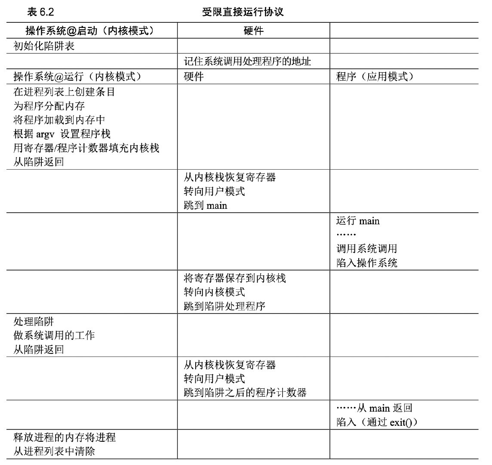

## 问题

OS想要以某种方式达到这样的效果：多个进程共享CPU，一个进程运行一段时间，然后运行另外一个进程， 如此反复，看起来像是在同时运行多个进程。

那么，如何不增加**额外开销**的情况，实现时分共享的机制呢？

## Limited Direct Execution(受限直接执行)

不增加额外开销，直接让程序运行在CPU上，没有中间商赚差价。

.png)

但是这样会引入两个新的问题：

(1)如果这样的话，程序不就可以有任意权限了吗？（程序直接运行在CPU上）
(2)什么时候暂停这个进程，来实现时分共享呢？

### 1.限制权限（用户态和内核态）

OS和进程都是程序，如果我们只让OS执行某些特权命令，普通进程必须要访问OS才行，不就可以解决这个问题了？

#### 如何做到限制？
换句话说，如果在执行创建文件这个命令的时候，我们把CPU占用从进程代码切换到内核代码，让操作系统决定，这个文件能不能创建，让操作系统去检查是否有权限创建，让进程内的代码**有限制地**执行。

#### 系统调用
这些特权指令，统称为系统调用，如创建进程(fork)，访问磁盘(open)，分配内存(malloc)等等。

#### 如何实现系统调用？
当进程发起系统调用后，如何让进程陷入内核代码（内核态）呢？

OS提供了陷阱指令来完成特权指令的调用，简单来说就是当执行系统调用，会中断当前的控制流，陷入到内核态，执行相应的系统调用。内核的处理程序在执行结束后，会将结果返回给进程，同时退回到用户态。进程此时继续执行下一条指令。

因此，陷阱也称软中断。

### 2.进程间切换

### 又引发新问题了？

没错，计算机的世界就是这样，从来没有完美的东西。

中断挺好，解决了一个问题，同时又引入了一个新问题，并发！设想一下，一个没有规律的中断，时不时暂停你的程序，然后切换到另外一个进程，这个时候，如果两个进程同时在做加数处理呢？

【举代码的例子 ++的例子】
## 总结

reference:https://imageslr.com/2020/07/09/trap-interrupt-exception.html#system-call